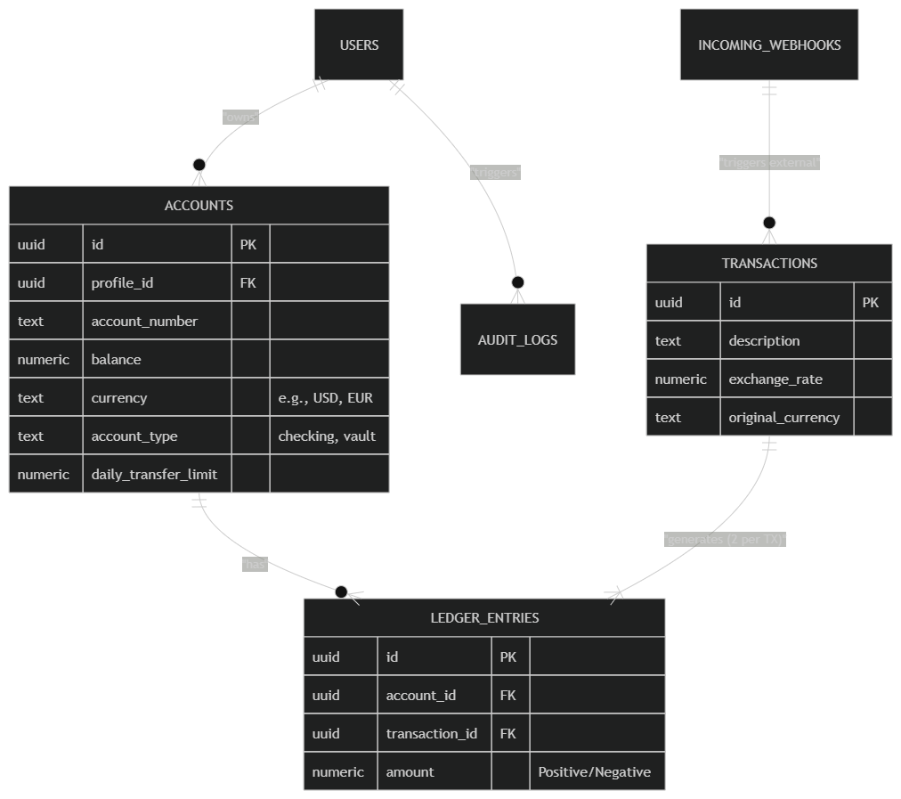
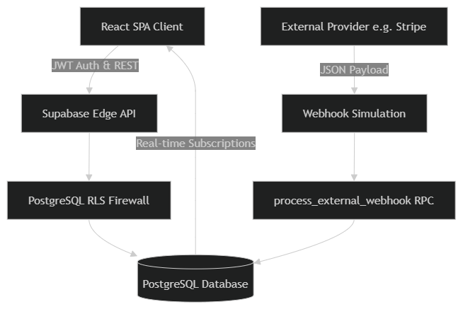
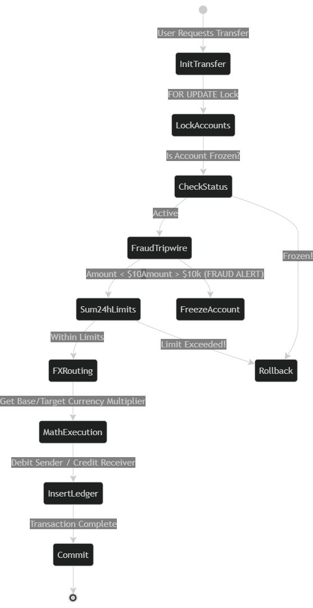

# 🚀 FintechEngine V1.0


A full-stack, enterprise-grade neobank engine featuring a deterministic double-entry ledger, multi-currency FX routing, and real-time webhook ingestion. Built to demonstrate high-level relational database architecture, concurrency management, and secure financial state handling.

---

## ✨ Core Features

*   **⚖️ Double-Entry Ledger:** A mathematically sound accounting backend where funds are strictly debited and credited via PostgreSQL `SECURITY DEFINER` RPCs, guaranteeing money is never created or destroyed.
*   **🛡️ Enterprise Security & MVCC Immunity:** Built with strict Row Level Security (RLS). Database queries are mathematically anchored using deterministic UUID tie-breakers to prevent PostgreSQL MVCC row-shifting bugs.
*   **🌍 Multi-Currency Wallets & FX:** Dynamic cross-border transfer routing with historical exchange rates perfectly preserved in the transaction ledger.
*   **⚡ Idempotent Webhook Ingestion:** Safely ingest mock third-party API payloads (Stripe/Plaid) using Postgres `JSONB` columns, protected by `UNIQUE` idempotency locks to prevent double-crediting.
*   **🔒 TOTP 2FA & Audit Logging:** Cryptographically append-only database logs ensuring regulatory compliance for all critical account actions.
*   **🎨 Glassmorphism UI & Dark Mode:** Lightning-fast, hardware-accelerated class-based theming utilizing the new **Tailwind v4** CSS engine.

---

## 🏛️ System Architecture 

### 1. Entity-Relationship Diagram (ERD)
The core database structure anchoring the double-entry accounting system.


### 2. Data Flow Diagram (DFD)


### 3. Sequence Diagram (SD)


### 4. Use Case Diagram (UCD)


## 🛠️ Tech Stack
Frontend: React 18, Vite, TypeScript, React Query (TanStack).

Styling: Tailwind CSS v4, custom CSS variables, class-based dark mode.

Backend as a Service (BaaS): Supabase.

Database: PostgreSQL (utilizing Advanced RPCs, Triggers, JSONB, and Row Level Security).

Icons: Lucide-React.

Deployment: Vercel (Configured with Edge SPA routing rewrites).

## 🚀 Getting Started
Prerequisites
Node.js (v18+)

A free Supabase account

## 🚀 Getting Started

### Prerequisites
* **Node.js**: v18+
* **Supabase**: A free account

### Local Installation

1. **Clone the repository:**
   ```bash
   git clone [https://github.com/yourusername/fintechengine.git](https://github.com/yourusername/fintechengine.git)
   cd fintechengine

   2. **Install dependencies:**
   ```bash
   npm install

##   🌐 Production Deployment (Vercel)
This application is configured as a Single Page Application (SPA). To prevent 404 Not Found errors on hard refreshes in production, a vercel.json file is included in the root directory to rewrite all edge routing back to index.html.

Import the repository into Vercel.

Add your .env variables (VITE_SUPABASE_URL and VITE_SUPABASE_ANON_KEY) to the Vercel project settings.

Deploy!


Deployed by Kamlesh Singh Kotwal